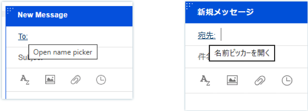
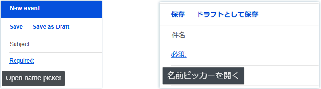
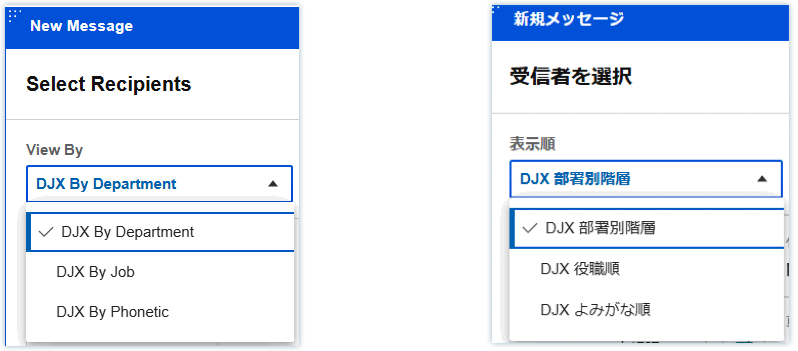
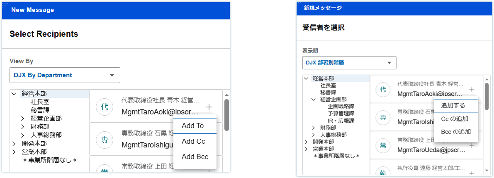
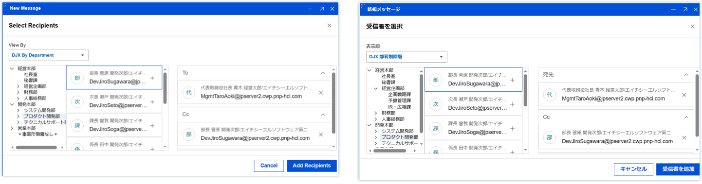

# Using DJX name picker

In HCL Verse 3.2.6, for Japanese customers who are using Domino Japanese eXtension \(DJX\), Verse has added the customized DJX name picker. Verse users will be able to open the DJX name picker when composing an email or creating an event. The name picker offers the ability to pick user names from three different lists categorized by ranked departments, ranked job titles, or ordered by phonetic name.

-   To open the DJX name picker:
    -   When creating a new email, you can click on the **To:** field to open the DJX name picker.

        

    -   When creating a new event, you can click on the "Required:" field label to open the DJX name picker.

        

        

-   In the name picker, you can switch between the three views provided to find the user you want to add to the email repient fields or the event recipient fields.

    

-   When you find the user, click on  and choose the field to which you wish to add the user.

    

-   When you are done, click the **Add Recipients** button to add the users to the email or event.

    

See [Enabling Domino Japanese eXtension name picker](../admin/enabling_djx_picker.md)

**Parent topic:** [User Documentation](../user/welcometoibmverse.md)

