# User Documentation

Domino Workspace Mail is mail that understands you. It has less clutter and more clarity for getting you connected to the people who matter to you most. Powered by HCL's analytics and advanced search, Domino Workspace Mail works for you, not the other way around.

{{ fullVerseProductName }} is mail that understands you. It has less clutter and more clarity for getting you connected to the people who matter to you most. Designed for mobile devices, and powered by HCL's analytics and advanced search, {{ fullVerseProductName }} works for you, not the other way around.
 
## Eight things you can do with {{ shortVerseProductName }}

Domino Workspace Mail allows connecting with people and uploading and sharing files. Share your calendar and see calendar availability for other mail users in your organization. Work with web-based mail, calendar and contact information, including type-ahead addressing, custom mail folders, support for mail threads, in depth search, view and work with files, and tracking of actions that need attention.. You can delegate your mail and calendar, or manage other people's mail and calendar.

{{ fullVerseProductName }} includes profiles, connecting with and following people so you can see their updates, uploading and sharing files, an activity stream, and status updates. Share your calendar and see calendar availability for other {{ shortVerseProductName }} subscribers in your organization. Work with web-based mail, calendar and contact information, including type-ahead addressing, custom mail folders, support for mail threads, in depth search, view and work with files, tracking of actions that need attention, and analytics-based identification of important content. You can delegate your mail and calendar, or manage other people's mail and calendar.
 
## See mail from people important to you

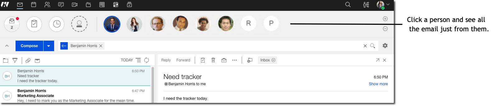

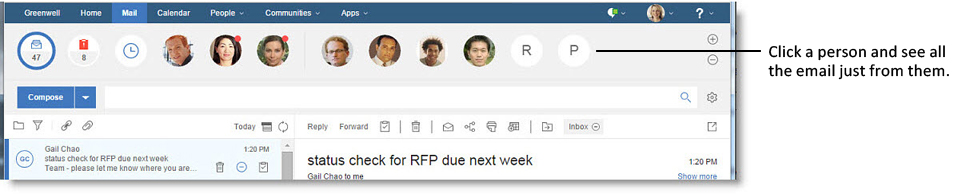
 
## Turn a suggested person into one of your favorites

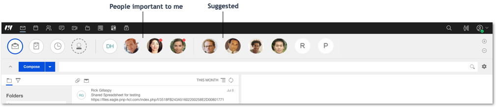

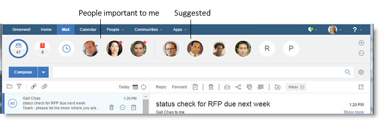
 

## Pin people to stay aware of what's new
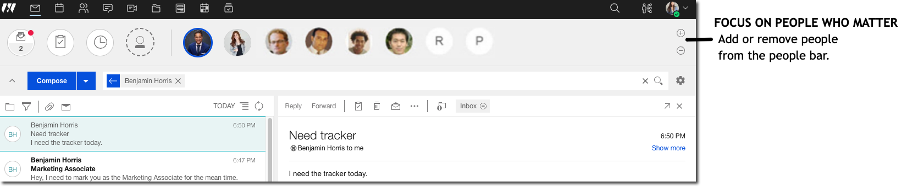

## Pin people and communities of interest to stay of aware of what's new
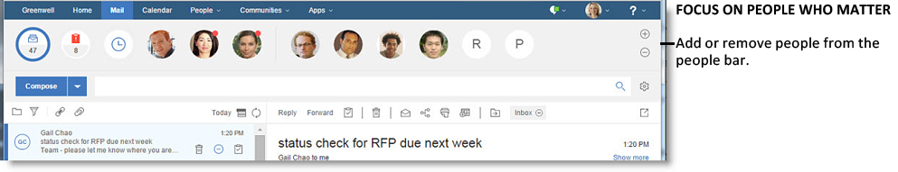
 
## Mark mail as Needs Action

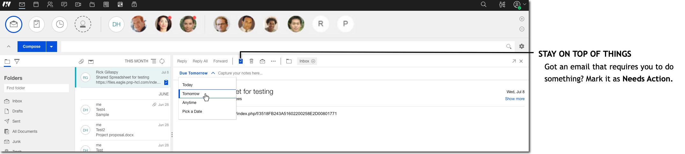

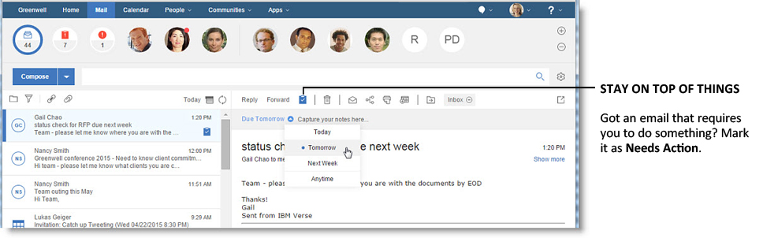
 
## Manage the items that need follow up

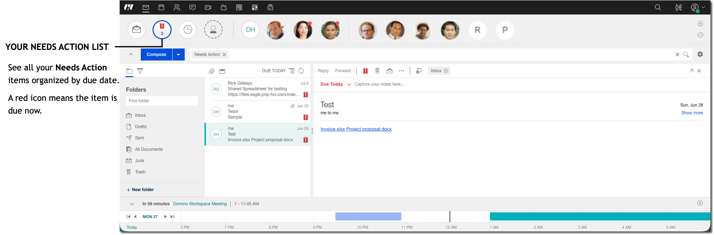


 
## Track who owes you a response and when

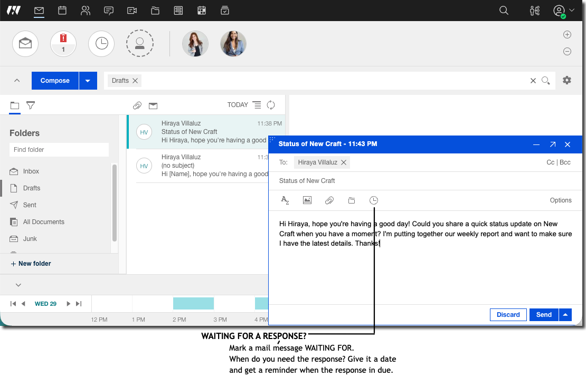

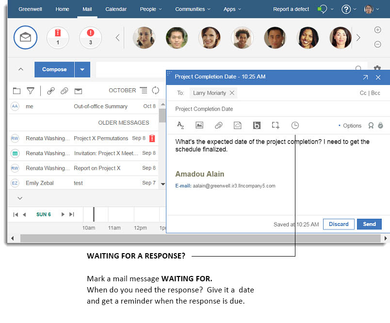
 
## See all messages marked Waiting For

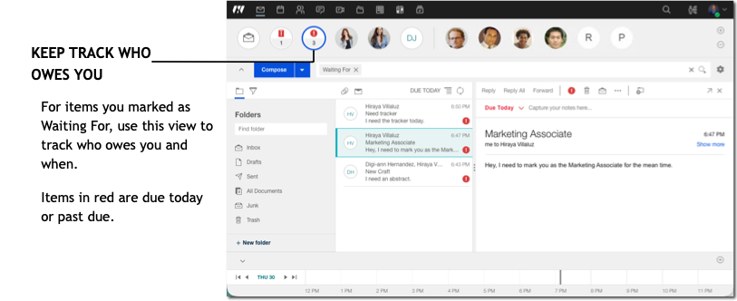

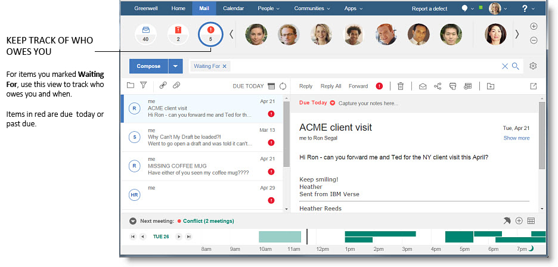
 
## Happiness is a clean inbox

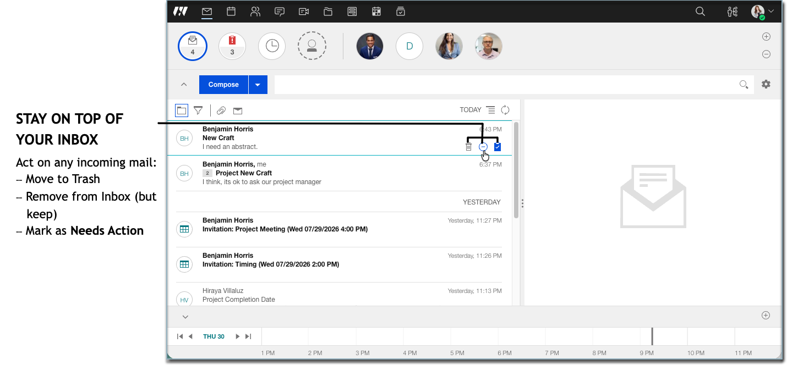

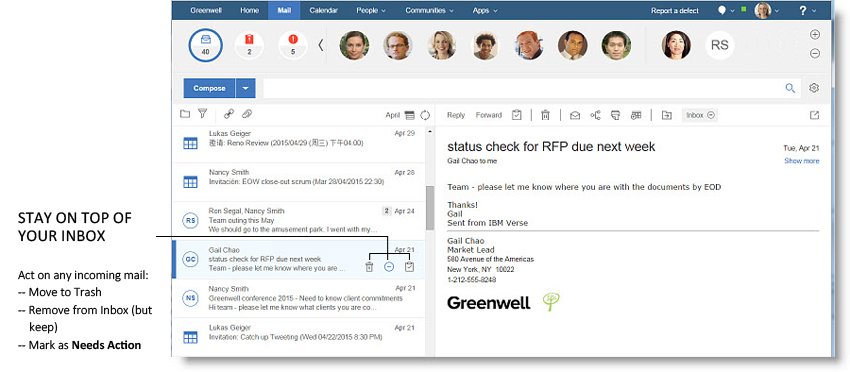
 

You can select and work with multiple messages by either selecting the individual people pictures in the message folder, or shift-selecting the messages themselves. Your selected messages appear in the message view, where you can mark them all as read or unread, delete them all, or move them to a folder.

You can select and work with multiple messages by either selecting the individual people avatars in the message list, or shift-selecting the messages themselves. Your selected messages appear in the message view, where you can mark them all as read or unread, delete them all, or move them to a folder.


-   **[HCL Doc IQ chatbot](../user/faq_dociqchat.md)**  
The HCL Doc IQ chatbot transforms the way you interact with {{ fullVerseProductName }} help documentation by providing a conversational, AI-powered search experience.


-   **[How do I run {{ shortVerseProductName }} as a standalone app?](../user/faq_run_standalone.md)**
    
    You can install and run HCL {{ shortVerseProductName }} as a standalone browser app that is based on progressive web app (PWA) technology.
    
    Beginning with HCL {{ shortVerseProductName }} 2.0, you can install and run {{ fullVerseProductName }} as a standalone browser app that is based on progressive web app (PWA) technology.
      

-   **[Why do I see people in the top bar?](../user/faq_people.md)**  
One of the main aspects of {{ fullVerseProductName }} that sets it apart is that it lets you have, within easy reach, all the things that are important to you. People are a big part of this idea.
-   **[How do I use business cards to see my colleagues' information with {{ fullVerseProductName }}?](../user/faq_biz_cards.md)**  
{{ fullVerseProductName }}® business cards keep all the necessary personal information for your contacts within easy reach, while at the same time taking it one step further. In {{ shortVerseProductName }}, the business card is more than just a source of contact information, it becomes a modern social tool, giving you the opportunity to interact with your colleagues in a variety of ways.  
-   **[How do I manage my personal contacts?](../user/faq_contacts.md)**  
Add contacts to save information about the people you communicate with in {{ fullVerseProductName }}.

-   **[How to view the certificate status of a personal contact?](../user/certificate_section_to_personal_contacts.md)**  
    
    Use the dedicated section in Contact forms for viewing the status of the contact's Notes certified public key or Internet certificate.
    
    In HCL {{ shortVerseProductName }} 3.2.6, there is now a dedicated section in Contact forms for viewing the status of the contact's Notes certified public key or Internet certificate.
    

-   **[How do I show my picture?](../user/FAQ_ProfilePicture.md)**   
    
    You can add or change the picture of yourself in the Mail "important to me" bar by uploading an image, pointing to a URL that has an image, or taking a photo of yourself.
    
    You can add or change the picture of yourself in the Verse "important to me" bar by uploading an image, pointing to a URL that has an image, or taking a photo of yourself. Or, you can use an image that you've added to the Gravatar web site.
    

-   **[How do I chat with my contacts?](../user/faq_chat.md)**  
{{ fullVerseProductName }}® gives you intuitive, integrated access to HCL Sametime® Chat in a way you've never had before. You can message colleagues all with the click of a button from the {{ shortVerseProductName }} interface.

-   **[How do I find what I'm looking for?](../user/faq_search.md)**  
One of the most powerful and useful features of {{ fullVerseProductName }} is its dynamic and analytics-driven search capacity. Search through every piece of mail with precision and ease.
-   **[How can I see my mail storage quota?](../user/how_can_i_see_my_mail_quota.md)**  
If your administrator sets a mail file quota to limit the size of your mail file, you can see how close your mail file is to quota.
-   **[How do I master mail?](../user/Verse_mail.md)**  
{{ fullVerseProductName }} gives you many great ways to take control of your mail.
-   **[How do I manage my calendar?](../user/faq_calendar.md)**  
{{ fullVerseProductName }} gives you many options for managing your work day, whether it's from the quick access Calendar Bar on your mail view, or the powerful and unique Calendar Inbox.

    
-   **[How do I share and link to my files?](../user/faq_files.md)**  
    HCL {{ shortVerseProductName }}® goes beyond simple file attachments by allowing you to share files and link to folders in the cloud. When composing a message, you can select files from your computer or files and folders from HCL Connections™.
    

-   **[How do I personalize {{ fullVerseProductName }}?](../user/faq_settings.md)**   
    From the navigation bar, click your profile image and then select **Verse Settings** to change mail, calendar, out of office, security, and delegation settings.

-   **[How do I manage passwords and my Notes ID?](../user/faq_manage_ids_t.md)**   
    
    If your administrator allows you to, you can use Security settings to change the password you use to log on to {{ shortVerseProductName }}.
    
    If your administrator allows you to, you can use Security settings to change the password you use to log on to Verse, to change your Notes ID password, and to manage your Notes ID.
    

-   **[How can I use keyboard shortcuts?](../user/faq_keyboard.md)**  
{{ fullVerseProductName }} gives you ways to simplify your experience through keyboard shortcuts.


-   **[Using DJX name picker](../user/using_djx_name_picker.md)**
 

