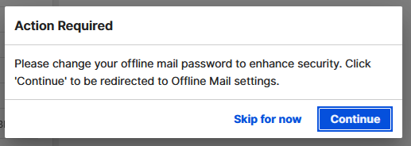

# Offline password update prompt

HCL Verse 3.2.6 IF1 requires users to update their offline password.

## **New security update for Verse mail offline**

A new security update for offline Verse mail, requiring users who previously set up offline to reset their password. Users who previously configured offline mail will be prompted to reset their password immediately upon logging into this new release.

for more information, see [How do I use Verse without an Internet connection?](../user/faq_offline.md)

**Parent topic:** [What's new in Verse 3.2.6 IF1?](../whats_new/whatsnew_3.2.6_IF1.md)