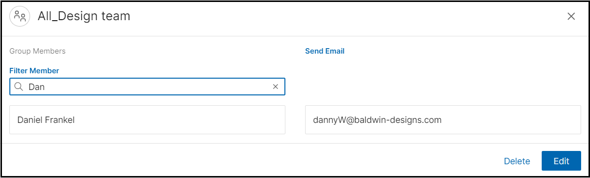

# Contacts enhancements

HCL Verse 3.2.2 provides the following features and enhancements related to contacts.

## Adding a group member using type-ahead

When creating a group contact, you can start typing in the **add member** field to produce a list of users that match the text. As you type, a Directory search is executed such that it finds users in the corporate directory and your personal contacts. You can select a user from the list to add the user to the group. If no matches are found, you need to enter the complete mail address of the user and click the '+' icon to add the user to the group.

## Filter members when viewing a group contact

When viewing a group contact, you can type in the **Filter Member** field in order to easily find group members that are listed in the group.

**Parent topic:** [What's new in Verse 3.2.2?](../whats_new/whatsnew_3.2.2.md)

