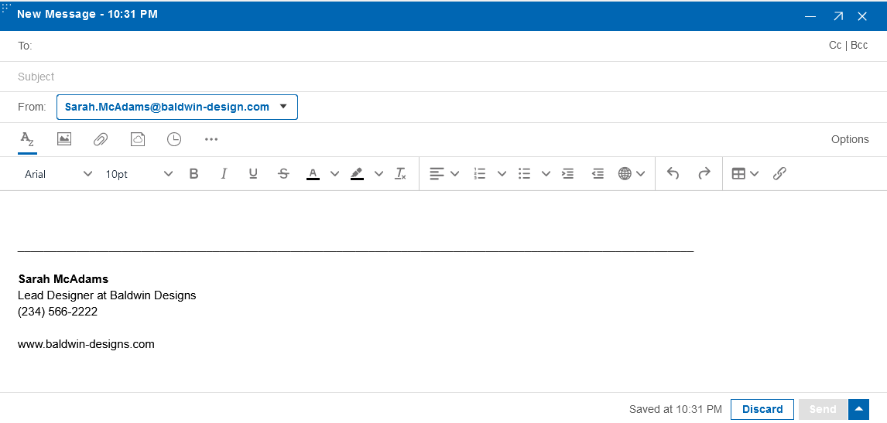

# Mail enhancements

HCL Verse 3.2 provides the following features and enhancements related to Mail.

## Keep Private option

This option allows you to mark the message private. This prevents the recipient from forwarding or copying the message. For more information, see [How can I keep my mails private?](../user/faq_keepprivate.md)

## TinyMCE editor in Mail Compose

In HCL Verse 3.2, the existing CKEditor is replaced with TinyMCE editor in Mail Compose .

**Parent topic:** [What's new in Verse 3.2?](../whats_new/whatsnew_3.2.0.md)

