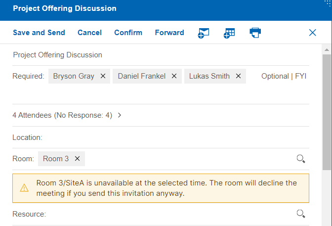

# Meeting enhancements

HCL Verse 3.2.2 provides the following features and enhancements related to meetings.

## Room/Resource check when rescheduling a meeting

When scheduling a meeting, you can select a Room or Resource. When rescheduling the same meeting, the Verse event form checks if the previously selected Room or Resource is available at the newly selected time. If it is not available, a message appears to inform you of the conflict.

**Parent topic:** [What's new in Verse 3.2.2?](../whats_new/whatsnew_3.2.2.md)

