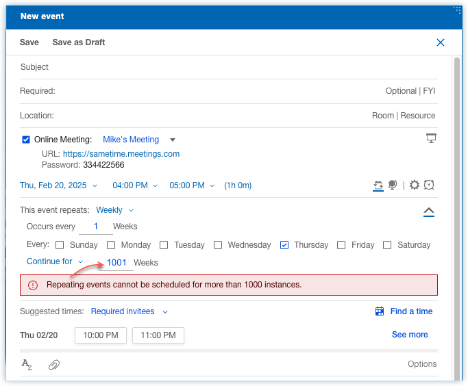

# Meeting enhancements

HCL Verse 3.2.4 provides the following enhancements related to meetings

## Limit repeat meeting instances

When scheduling a repeat meeting, you can configure how often the meeting repeats. If the number of meeting instances is 1000 or less, you can use the "Save" or "Save and Send" options. However, if the number of meeting instances is 1000, you will receive an alert message, and the "Save" and "Save and Send" actions will be disabled.

For more information, see [How do I schedule a meeting?](../user/faq_calendar_bar_create.md).

**Parent topic:** [What's new in Verse 3.2.4?](../whats_new/whats_new_3.2.4.md)

